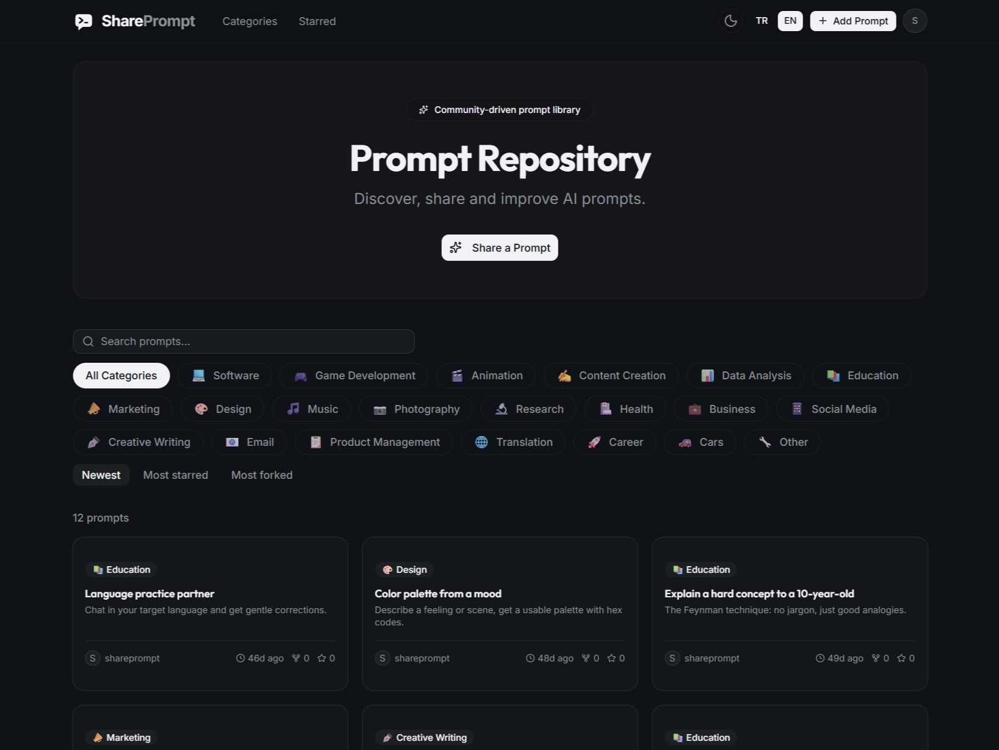
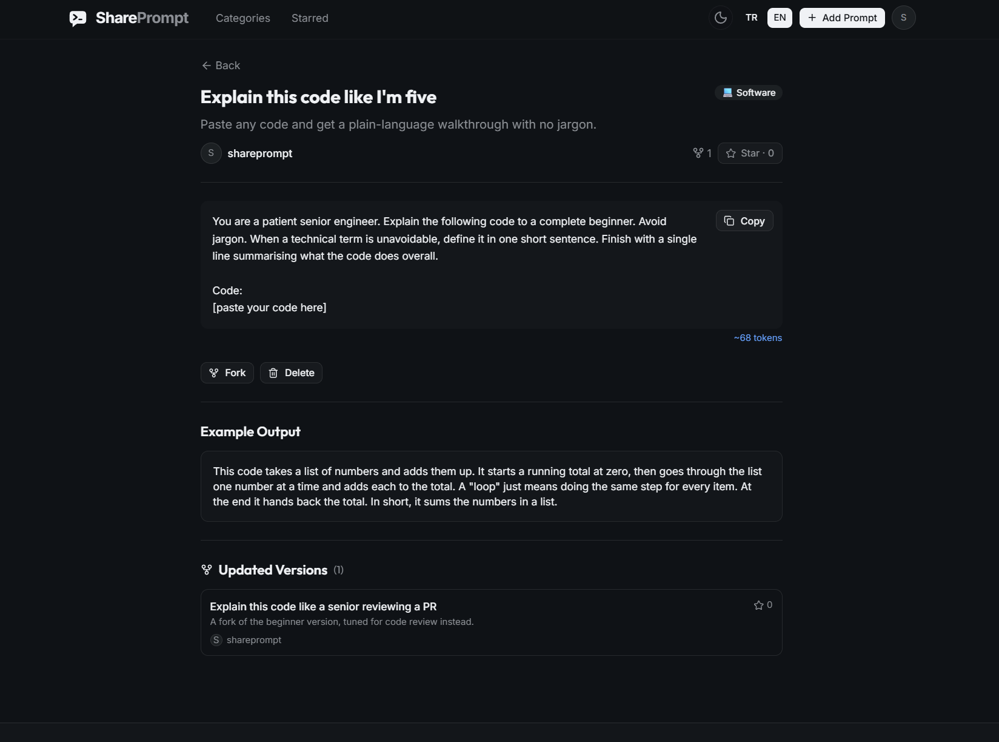

# SharePrompt

A place to share AI prompts and see the ones other people actually use.

Good prompts are hard to write and easy to lose. You spend time getting one to behave, paste it into a chat window, and a week later it's buried in your history somewhere. Meanwhile everyone else is rewriting the same prompt from scratch. SharePrompt is a small web app that fixes that: you post a prompt, show what it produced, and other people can star it, fork it, and build on it. Think of it like GitHub, but for prompts instead of code.

Live: https://shareprompt-prompt.vercel.app

## What you can do

- **Post a prompt** with a title, the prompt text, and an example of what it returns (text or an image).
- **Star** the ones you want to find again. The star count is how good prompts rise to the top.
- **Fork** a prompt to make your own version. The fork remembers where it came from, so you can trace a prompt back to the original.
- **Browse by category**, search by title, or sort by newest, most starred, or most forked.
- **Report** a prompt if something's off with it.

Each profile has a contribution score and an activity heatmap, so people who post prompts that others star get credit for it. You can edit your own profile too: photo, name, profession, education, and a short bio, with a visibility toggle on the fields you'd rather keep private.

A prompt page carries the prompt itself, an example of what it returned, and any versions other people forked from it.

## Categories

Prompts are filed under one of 21 categories:

💻 Software · 🎮 Game Development · 🎬 Animation · ✍️ Content Creation · 📊 Data Analysis · 📚 Education · 📣 Marketing · 🎨 Design · 🎵 Music · 📷 Photography · 🔬 Research · 🏥 Health · 💼 Business · 📱 Social Media · ✒️ Creative Writing · 📧 Email · 📋 Product Management · 🌐 Translation · 🚀 Career · 🚗 Cars · 🔧 Other

The whole site works in both Turkish and English.

## Built with

- Next.js 16 (App Router) and React 19
- Supabase for auth, Postgres, and image storage
- next-intl for Turkish/English
- Tailwind CSS v4 with shadcn/ui (on Base UI)
- Framer Motion for the animations
- Deployed on Vercel

## License

MIT — see [LICENSE](LICENSE).
